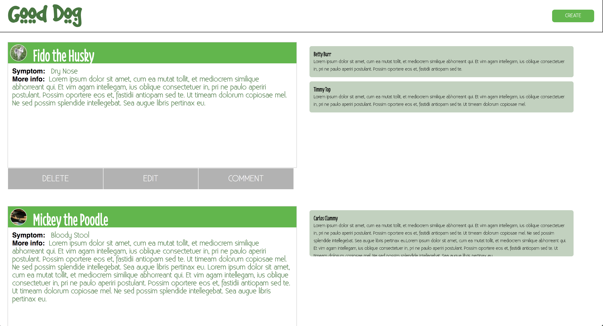

# Good Dog

## Summary
A web app that allows dog owners and/or dog enthusiasts to post their pet concerns on a public forum. Users can expect comments from people in their community who have experience with specific problems. Users can post comments of their own, helping other pet owners in need.

Link to live app: [App](https://good-dog.herokuapp.com)
 Demo Login: 
   username: demouser
   password: password

## Motivation
Being a dog owner myself, I wanted to create a forum that is dedicated solely to our loyal companions and their owners.

## Screenshots

## Technology
Built with:
- HTML
- CSS
- JavaScript
- jQuery
- Node.js
- Express
